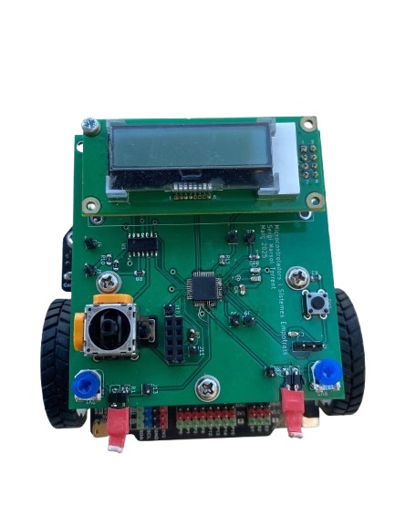
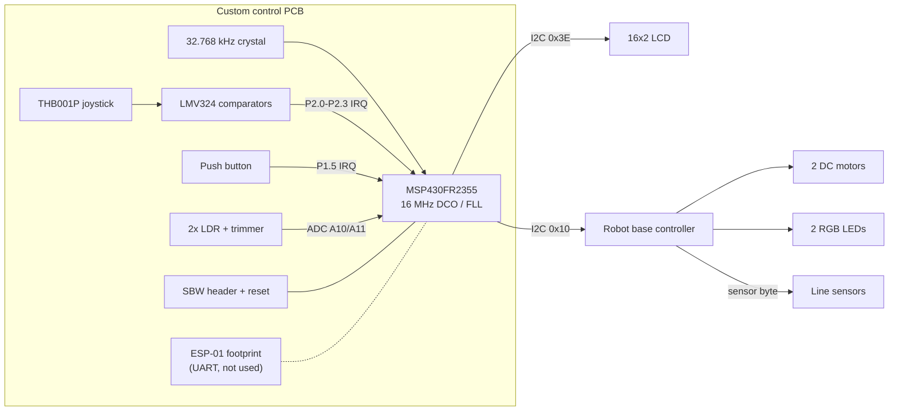
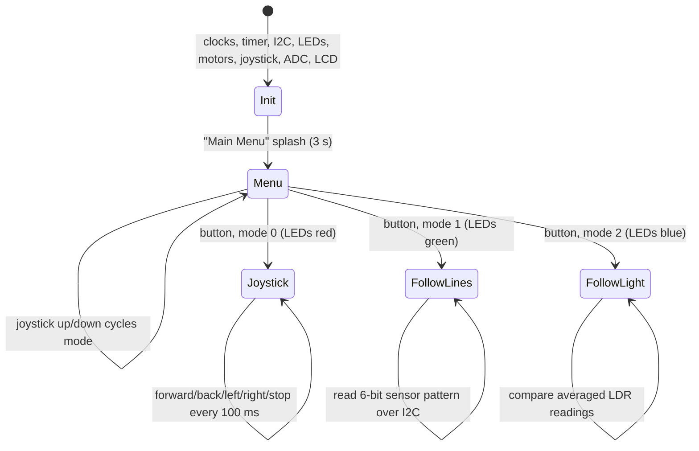
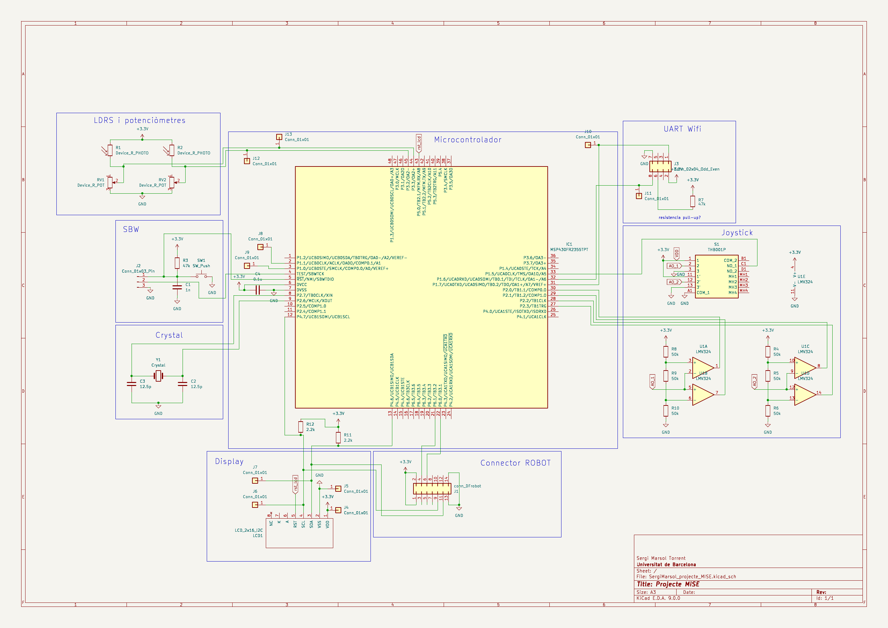
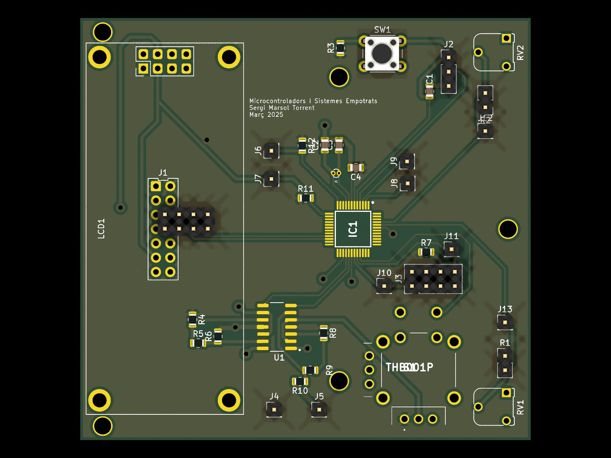
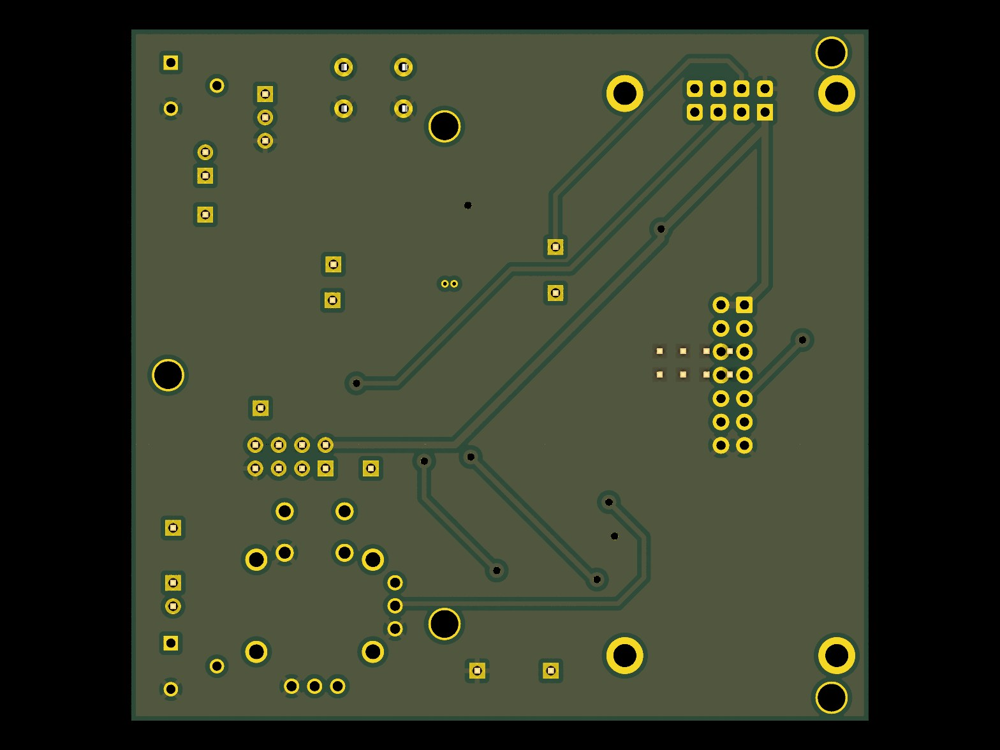

# MSP430 Robot Control PCB

**A custom two-layer KiCad control board and bare-metal C firmware for the MSP430FR2355. It drives a mobile robot in joystick, line-following and light-following modes, using an LCD menu and an interrupt-driven I2C bus.**

<p align="center">
  
</p>

## Overview

The goal: design a controller board for a mobile robot base, have it fabricated, assemble it, and write bare-metal firmware that lets a user pick an operating mode from an on-board menu and then either drive the robot by hand or let it run autonomously.

I did the whole project alone: block diagram, schematic, PCB layout, assembly, hardware debugging, and every firmware driver.

## What I built

- **Custom control PCB (KiCad).** I designed the schematic and two-layer layout around the 48-pin MSP430FR2355TPT. The board has:
  - a 32.768 kHz crystal and a Spy-Bi-Wire (SBW) programming header with a reset button,
  - a 16x2 I2C LCD,
  - a THB001P analog joystick conditioned by LMV324 comparators,
  - two LDR + trimmer voltage dividers on ADC inputs,
  - a 14-pin connector to the robot base, an ESP-01 (UART) footprint, and test points on the key signals.

  I ran ERC/DRC, generated the Gerbers and had the board fabricated and assembled.
- **Board bring-up and hardware fix.** During bring-up I found that the two LDR traces had been routed to pins without ADC capability. I replaced the microcontroller and reworked two tracks so the light sensors reach ADC channels A10/A11 (P5.2/P5.3).
- **Interrupt-driven I2C master driver.** eUSCI_B1 runs as an I2C master on P4.6/P4.7 at about 100 kHz (SMCLK 16 MHz / 160). TX and RX are handled in the ISR while the CPU sleeps in LPM0. One `I2C_send`/`I2C_receive` pair serves all peripherals:
  - the robot base at address `0x10`: motors (command `0x00`), RGB LEDs (`0x0B`) and line sensors (`0x1D`),
  - the LCD at `0x3E`.
- **Clock and timing.** The DCO runs at 16 MHz via an FLL referenced to the external 32.768 kHz crystal. Timer B0 gives a 1 ms tick that drives `delay_ms()`.
- **Light following (ADC).** The ADC converts at 12 bits and the ADC ISR alternates between the two LDR channels, averaging 16 samples per channel. The robot turns toward the brighter side when the left–right difference is more than ±250 counts, and goes straight otherwise. It shows live `L=… | R=…` readings on the LCD.
- **Line following.** The firmware reads the base's ground-sensor byte over I2C, masks the six sensor bits, and maps the patterns to forward, left, right or stop.
- **Joystick control and LCD menu.** The four comparator outputs of the joystick raise falling-edge interrupts on P2.0–P2.3, and the push button raises one on P1.5. Up/down cycles through the three modes; each mode has its own LED colour (red, green or blue) and LCD label, and the button confirms the choice.

## How it works



### Operating modes (`main.c`)



### I2C message formats

| Target | Address | Payload |
|---|---|---|
| Motors | `0x10` | `0x00, dirL, speedL, dirR, speedR` (speed 0–255) |
| RGB LEDs | `0x10` | `0x0B, colourL, colourR` (OFF, RED, GREEN, YELLOW, BLUE, PURPLE, PINK, WHITE = `0x00`–`0x07`) |
| Line sensors | `0x10` | write `0x1D`, then read 1 byte (one bit per sensor) |
| LCD | `0x3E` | `0x00` + command bytes, or `@` + ASCII text |

## Hardware

| Schematic | PCB 3D render (top) | PCB 3D render (bottom) |
|---|---|---|
|  |  |  |

| Block | Implementation |
|---|---|
| MCU | MSP430FR2355TPT (LQFP-48), 3.3 V, decoupling next to the supply pins |
| Clock | 32.768 kHz crystal, 12.5 pF load capacitors |
| Programming | 3-pin Spy-Bi-Wire header; reset button with 47 kΩ pull-up |
| Display | 16x2 I2C LCD (Midas, MCCOG controller), hardware reset line from the MCU |
| Joystick | THB001P, analog axes thresholded by LMV324 comparators into interrupt-capable GPIOs |
| Light sensors | 2 LDRs, each in a divider with a trimmer, read by the ADC |
| Robot connector | 14-pin DFRobot connector: VCC, GND, I2C SDA/SCL, 2 GPIOs |
| Wi-Fi | ESP-01 on UART, placed on the board but **not implemented in firmware** |
| Debug | Single-pin test points on the main signals |

Layout rules, from the PCB design report:
- Board outline at most 75 × 80 mm.
- Track widths: 0.75 mm for power and GND, 0.5 mm for signals, 0.25 mm minimum.
- Clearance: 0.2 mm between tracks and pads, 0.3 mm to copper zones.
- VCC pour on the front copper layer and GND pour on the back.
- No right-angle tracks.
- MCU and op-amp in the centre of the board, connectors at the edges.

## Firmware architecture

| Module | Responsibility |
|---|---|
| `main.c` | Initialise peripherals, LCD menu, mode selection, main control loop |
| `timer.c/.h` | 16 MHz clock setup (FLL + XT1), Timer B0 1 ms ISR, `delay_ms()` |
| `i2c.c/.h` | eUSCI_B1 I2C master, interrupt-driven `I2C_send` / `I2C_receive` |
| `lcd.c/.h` | LCD initialisation, text, line change, clear, formatted values, 1- and 2-line helpers |
| `leds.c/.h` | RGB LED colour commands |
| `motors.c/.h` | Motor command packet plus `forward`, `backward`, `turn_left`, `turn_right`, `stop` |
| `joystick.c/.h` | Joystick and stop-button GPIO interrupts, joystick-driven motion |
| `ADC.c/.h` | 12-bit ADC on two LDR channels, 16-sample averaging ISR, light-following control |
| `sensors.c/.h` | Line-sensor read over I2C, line-following control |

The CCS build map committed in `firmware/Debug/` reports about 4.0 KB of the 32 KB FRAM and 203 bytes of the 4 KB RAM in use.

## Tech stack

- **MCU:** TI MSP430FR2355
- **Firmware:** C (bare-metal, register level), TI Code Composer Studio 12.8 with TI MSP430 compiler 21.6.1 LTS
- **EDA:** KiCad 9 (schematic, layout, 3D, Gerbers)
- **Interfaces:** I2C, ADC, GPIO interrupts, timers, low-power modes

## Repository structure

```
.
├── firmware/                  # C sources and headers for every driver
│   ├── main.c
│   ├── ADC.c/.h  i2c.c/.h  joystick.c/.h  lcd.c/.h
│   ├── leds.c/.h  motors.c/.h  sensors.c/.h  timer.c/.h
│   ├── lnk_msp430fr2355.cmd   # Linker command file
│   ├── targetConfigs/         # CCS debug-probe target configuration
│   └── Debug/                 # CCS build output (generated)
├── hardware/
│   ├── robot_control_board.kicad_pro / .kicad_sch / .kicad_pcb
│   ├── gerbers/    # Fabrication outputs (Gerbers + drill)
│   ├── libraries/MiSE.pretty/ # Course-provided footprint library
│   └── fp-lib-table           # Points to the project-relative MiSE library
├── figures/                   # README images (rendered from KiCad and the presentation)
├── documents/
│   └── presentation.pdf       # Final project presentation (Catalan)
├── LICENSE
└── README.md
```

## Getting started

### Hardware
1. Install **KiCad 9** or newer. The project files were saved with KiCad 9.0.
2. Open `hardware/robot_control_board.kicad_pro`. The `MiSE` footprint library resolves automatically through `${KIPRJMOD}/libraries/MiSE.pretty`.
3. Ready-to-send fabrication files are in `hardware/gerbers/`.

### Firmware
The repository holds the sources only, not the CCS `.project`/`.cproject` files, so you build them in a new project:
1. In Code Composer Studio, create a new **MSP430FR2355** project (empty C project).
2. Copy the `.c`/`.h` files from `firmware/` into it, plus `lnk_msp430fr2355.cmd` (or use the linker file CCS generates for the device).
3. Build, connect an MSP-FET or a LaunchPad eZ-FET to the board's SBW header, and click **Debug** to flash.
4. On boot the LCD shows the main menu. Move the joystick up/down to choose a mode and press the button to start it.

## Status and limitations

- The ESP-01 Wi-Fi module is on the PCB, but there is no UART or Wi-Fi code.
- Motor speed is fixed at 50/255 in every mode. Control is reactive (bang-bang), with no closed-loop speed control.
- The ±250-count light threshold and the line-sensor bit patterns were tuned by hand for the lab setup.

## Acknowledgements

- Developed for *Microcontrollers and Embedded Systems* (Electronic & Telecommunications Engineering, Universitat de Barcelona, spring 2025).
- The robot base (motor, LED and line-sensor controller reachable over I2C) and the `MiSE.pretty` footprint library came with the course.
- Author: **Sergi Marsol** (individual project).

## License

Released under the [MIT License](LICENSE). The course-provided footprint library in `hardware/libraries/MiSE.pretty/` keeps its original terms.
